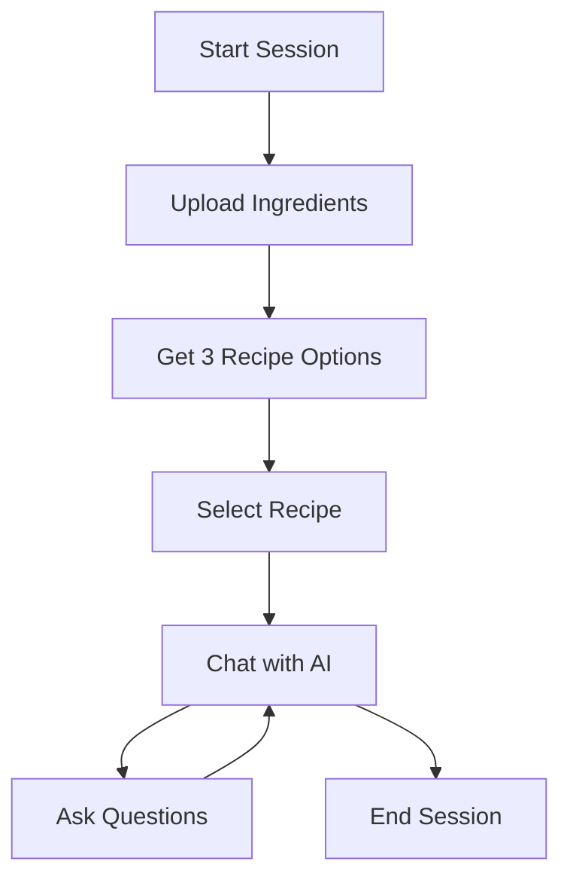

# 🍳 Chef AI: Smart Recipe Generator Backend

> Transform your ingredients into delicious recipes with AI-powered cooking assistance

Chef AI is an intelligent, conversational backend service that revolutionizes home cooking by converting user-provided ingredients into personalized recipes. Leveraging cutting-edge multimodal AI technology, it understands ingredients from both text descriptions and images, generates tailored recipe suggestions, and provides interactive cooking guidance through an intelligent chat interface.

## ✨ Key Features

### 🧠 **Multimodal Ingredient Recognition**
- **Text Input**: Simply list your available ingredients as text
- **Image Upload**: Take a photo of your fridge contents or ingredients for automatic recognition
- **Smart Processing**: Advanced AI understands various ingredient formats and presentations

### 🧑‍🍳 **Dynamic Recipe Generation**
- **Multiple Options**: Generates three unique, practical recipes from your ingredients
- **Home-Cooking Focused**: Recipes designed for real home kitchens with realistic preparation times
- **Ingredient Optimization**: Makes the most of what you have while suggesting minimal additions

### 💬 **Context-Aware AI Chat**
- **Interactive Guidance**: Ask questions about cooking techniques, substitutions, or modifications
- **Recipe-Focused**: AI stays strictly on-topic, providing relevant cooking assistance
- **Step-by-Step Help**: Get detailed explanations for any part of the cooking process

### 🛡️ **Robust AI Control**
- **Advanced Prompt Engineering**: Ensures reliable, focused responses
- **Manipulation Resistant**: Protected against off-topic conversation attempts
- **Consistent Behavior**: Reliable AI persona across all interactions

### 🚀 **Performance & Architecture**
- **High Performance**: Built with FastAPI for optimal speed and scalability
- **Clean Architecture**: Modular design with clear separation of concerns
- **Smart Optimization**: Automatic image preprocessing reduces costs and improves response times
- **Rate Protection**: Built-in rate limiting prevents API abuse

## ⚙️ Tech Stack

| Component | Technology |
|-----------|------------|
| **Backend Framework** | FastAPI |
| **AI Integration** | OpenRouter API |
| **Database** | SQLModel with SQLite |
| **Data Validation** | Pydantic |
| **Image Processing** | Pillow (PIL) |
| **Containerization** | Docker & Docker Compose |

## 🚀 Quick Start

### Prerequisites
- Python 3.8+ (for local development)
- Docker & Docker Compose (recommended)
- OpenRouter API key

### 📋 Configuration

1. **Create environment file**:
   ```bash
   cp env.example .env
   ```

2. **Configure your API key**:
   ```env
   # .env file
   
   # Your OpenRouter API key (required)
   OPENROUTER_API_KEY="sk-or-v1-your-key-here"
   
   # OpenRouter API base URL (default: no change needed)
   OPENROUTER_BASE_URL="https://openrouter.ai/api/v1"
   
   # Database configuration
   DATABASE_FILE="chef_ai.db"
   
   # Debug configuration
   # Set to true for development, false for production
   DEBUG_MODE=false
   
   # CORS Configuration
   # Allow all origins (default)
   CORS_ORIGINS=*
   
   # OR specify specific origins (comma-separated)
   # CORS_ORIGINS=https://yourdomain.com,https://app.yourdomain.com,http://localhost:3000
   ```

### 🐛 Debug Mode

The application includes a debug mode that can be enabled or disabled via environment variables:

1. **Configuration**:
   - Set `DEBUG_MODE=true` in your `.env` file to enable debugging features
   - Set `DEBUG_MODE=false` in production to disable debugging features

2. **Debug Features**:
   - When enabled, the root endpoint (`/`) will display detailed environment information
   - A special `/debug` endpoint becomes available with comprehensive configuration details
   - More detailed error messages and configuration information are exposed

3. **Heroku Configuration**:
   ```bash
   # Enable debug mode (for troubleshooting only)
   heroku config:set DEBUG_MODE=true --app your-app-name
   
   # Disable debug mode (for production)
   heroku config:set DEBUG_MODE=false --app your-app-name
   ```

4. **Security Note**: 
   - Always disable debug mode in production environments
   - Debug mode exposes configuration details that could be sensitive

### 🔒 CORS Configuration

For production deployment, you should configure CORS (Cross-Origin Resource Sharing) to specify which domains can access your API:

1. **Basic Configuration**:
   - Set `CORS_ORIGINS` in your `.env` file to control which domains can access your API
   - Use `*` to allow all origins (not recommended for production)
   - Use comma-separated list for multiple specific origins

   ```env
   # Allow all origins (development only)
   CORS_ORIGINS=*
   
   # Allow specific origins (recommended for production)
   CORS_ORIGINS=https://your-frontend-domain.com,https://admin.your-domain.com
   ```

2. **Advanced Configuration**:
   - Additional CORS settings can be customized in `.env` file:

   ```env
   # Control allowed HTTP methods
   CORS_ALLOW_METHODS=GET,POST,PUT,DELETE,OPTIONS
   
   # Control allowed headers
   CORS_ALLOW_HEADERS=Content-Type,Authorization
   
   # Set whether credentials are allowed
   CORS_ALLOW_CREDENTIALS=true
   
   # Set cache duration for preflight requests (in seconds)
   CORS_MAX_AGE=600
   ```

3. **Heroku Configuration**:
   - When deploying to Heroku, set these values using the Heroku CLI or dashboard:

   ```bash
   heroku config:set CORS_ORIGINS=https://your-frontend-domain.com --app your-app-name
   ```

### 🐳 Option 1: Docker (Recommended)

**Why Docker?** Handles all dependencies automatically and ensures consistent environment across different systems.

```bash
# Build and start the application
docker-compose up --build

# Run in background
docker-compose up -d --build
```

✅ **Ready!** API available at `http://127.0.0.1:8000`

### 🐍 Option 2: Local Development

```bash
# Create virtual environment
python -m venv venv

# Activate virtual environment
# Linux/Mac:
source venv/bin/activate
# Windows:
venv\Scripts\activate

# Install dependencies
pip install -r requirements.txt

# Start development server
uvicorn app.main:app --reload
```

✅ **Ready!** API available at `http://127.0.0.1:8000`

## 📚 API Documentation

### Interactive Documentation
- **Swagger UI**: `http://127.0.0.1:8000/docs` (recommended)
- **ReDoc**: `http://127.0.0.1:8000/redoc`

### API Workflow

The Chef AI API follows a simple session-based workflow:



### Endpoints Overview

| Method | Endpoint | Description | Request Type |
|--------|----------|-------------|--------------|
| `POST` | `/api/session/` | **Create Session**: Upload ingredients (text/image) and get recipes | `multipart/form-data` |
| `POST` | `/api/session/{context_id}/select` | **Select Recipe**: Choose from generated recipes | `application/json` |
| `POST` | `/api/session/{context_id}/chat` | **Chat**: Ask questions about selected recipe | `application/json` |
| `DELETE` | `/api/session/{context_id}` | **End Session**: Clean up session data | - |

### Example Usage

#### 1. Start a Session with Ingredients

**Text Input:**
```bash
curl -X POST "http://127.0.0.1:8000/api/session/" \
  -F "ingredients_text=chicken breast, broccoli, garlic, soy sauce"
```

**Image Upload:**
```bash
curl -X POST "http://127.0.0.1:8000/api/session/" \
  -F "ingredients_image=@fridge_photo.jpg"
```

#### 2. Select a Recipe
```bash
curl -X POST "http://127.0.0.1:8000/api/session/{context_id}/select" \
  -H "Content-Type: application/json" \
  -d '{"recipe_id": 1}'
```

#### 3. Chat with AI
```bash
curl -X POST "http://127.0.0.1:8000/api/session/{context_id}/chat" \
  -H "Content-Type: application/json" \
  -d '{"message": "How long should I marinate the chicken?"}'
```

## 🏗️ Architecture

### Project Structure
```
chef-ai/
├── app/
│   ├── routers/             # API route handlers
│   ├── services/            # Business logic layer
│   ├── config.py            # Config file
│   ├── db.py                # Database center
│   ├── deps.py              # Helper function
│   ├── main.py              # FastAPI application entry point
│   ├── models.py            # Database models
│   ├── prompts.py           # Prompt management
│   └── schemas.py           # Pydantic data models
├── requirements.txt         # Python dependencies
├── docker-compose.yml       # Docker configuration
├── Dockerfile               # Container definition
└── .env.example             # Environment template
```

### Design Principles
- **Separation of Concerns**: Clear boundaries between routing, business logic, and data
- **Dependency Injection**: Loose coupling for better testability
- **Type Safety**: Full Pydantic validation and type hints
- **Scalable**: Modular architecture supports easy feature additions

## 📊 Project Assessment

### 👍 **Strengths**

**🎯 Robust AI Control**
- Advanced prompt engineering ensures reliable, focused AI behavior
- Resistant to manipulation and off-topic conversations
- Consistent persona across all interactions

**🏗️ Clean Architecture**
- Well-structured codebase with clear separation of concerns
- Easy to understand, maintain, and extend
- Modern Python best practices throughout

**⚡ Efficient Design**
- Single multimodal AI model handles all tasks
- Smart image preprocessing reduces API costs
- Optimized for performance and resource usage

**🔧 Developer Experience**
- Comprehensive API documentation
- Docker support for easy setup
- RESTful design with proper HTTP semantics

### 👎 **Areas for Improvement**

**🗄️ Database Scalability**
- Current SQLite setup ideal for development
- **Production consideration**: Migrate to PostgreSQL for high-concurrency scenarios

**🔄 State Management**
- In-memory rate limiting doesn't persist across restarts
- **Scaling consideration**: Implement Redis for shared state management

**🔐 Security**
- No authentication layer currently implemented
- **Production requirement**: Add JWT/OAuth2 authentication system

**🌐 Language Detection**
- Basic keyword-based language detection
- **Enhancement opportunity**: Integrate dedicated language detection library

## 🛣️ Roadmap

### Phase 1: Core Enhancements
- [ ] PostgreSQL integration
- [ ] Redis-based rate limiting
- [ ] Enhanced error handling

### Phase 2: Security & Auth
- [ ] JWT authentication
- [ ] User management system
- [ ] API key management

### Phase 3: Advanced Features
- [ ] Recipe rating system
- [ ] Ingredient substitution suggestions
- [ ] Nutritional information integration

## 🤝 Contributing

We welcome contributions! Please see our contributing guidelines for details on how to:
- Report bugs
- Suggest features
- Submit pull requests

## 📄 License

This project is licensed under the MIT License - see the LICENSE file for details.

## 🆘 Support

- **Documentation**: Check the `/docs` endpoint when running
- **Issues**: Report bugs via GitHub Issues
- **Questions**: Start a discussion in GitHub Discussions

---

<div align="center">

**Built with ❤️ for home cooks everywhere**

[Documentation](http://127.0.0.1:8000/docs) • [API Reference](http://127.0.0.1:8000/redoc) • [Contributing](#contributing)

</div>

## Deployment to Heroku

### Prerequisites

1. [Heroku CLI](https://devcenter.heroku.com/articles/heroku-cli) installed
2. Heroku account
3. Git installed

### Steps to Deploy

1. Login to Heroku CLI:
   ```
   heroku login
   ```

2. Create a new Heroku app:
   ```
   heroku create your-app-name
   ```

3. Add PostgreSQL addon:
   ```
   heroku addons:create heroku-postgresql:hobby-dev
   ```

4. Set environment variables:
   ```bash
   # Required settings
   heroku config:set OPENROUTER_API_KEY=your_api_key --app your-app-name
   
   # CORS configuration (important for frontend access)
   # For single origin:
   heroku config:set CORS_ORIGINS=https://your-frontend-domain.com --app your-app-name
   
   # For multiple origins (comma-separated):
   heroku config:set CORS_ORIGINS=https://app.yourdomain.com,https://admin.yourdomain.com --app your-app-name
   
   # For development/testing (not recommended for production):
   # heroku config:set CORS_ORIGINS=* --app your-app-name
   
   # Optional advanced CORS settings
   heroku config:set CORS_ALLOW_METHODS=GET,POST,PUT,DELETE,OPTIONS --app your-app-name
   heroku config:set CORS_ALLOW_HEADERS=Content-Type,Authorization --app your-app-name
   heroku config:set CORS_ALLOW_CREDENTIALS=true --app your-app-name
   ```

5. Deploy the application:
   ```
   git push heroku main
   ```

6. Run database migrations:
   ```
   heroku run python -c "from app.db import init_db; init_db()"
   ```

7. Open the application:
   ```
   heroku open
   ```

8. Test the API with your frontend by making a request to:
   ```
   https://your-app-name.herokuapp.com/api/session/
   ```

### Setting Up Custom Domain

1. Add your custom domain to Heroku:
   ```bash
   heroku domains:add api.yourdomain.com --app your-app-name
   ```

2. Get the DNS target:
   ```bash
   heroku domains --app your-app-name
   ```

3. Add a CNAME record at your DNS provider:
   - Record Type: CNAME
   - Name/Host: api
   - Value/Target: your-app-name.herokuapp.com.herokudns.com

4. Enable SSL:
   ```bash
   heroku certs:auto:enable --app your-app-name
   ```

5. Verify setup:
   ```bash
   host api.yourdomain.com
   ```

6. Update your frontend to use the new domain with CORS:
   ```bash
   heroku config:set CORS_ORIGINS=https://yourdomain.com --app your-app-name
   ```

## Local Development

1. Create a virtual environment:
   ```
   python -m venv env
   source env/bin/activate  # On Windows: env\Scripts\activate
   ```

2. Install dependencies:
   ```
   pip install -r requirements.txt
   ```

3. Create a `.env` file with the following variables:
   ```
   OPENROUTER_API_KEY=your_api_key
   OPENROUTER_BASE_URL=https://openrouter.ai/api/v1
   OPENROUTER_MODEL=opengvlab/internvl3-14b:free
   CORS_ORIGINS=http://localhost:3000
   ```

4. Run the application:
   ```
   uvicorn app.main:app --reload
   ```

5. Access the API documentation at http://localhost:8000/docs